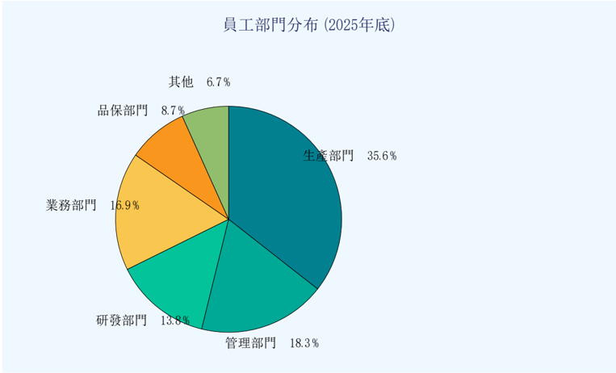

## 中鋼碳素化學股份有限公司

公司簡介與組織概況

China Steel Chemical Corporation (CSCC)

| 項⽬       | 內容                             |
|------------|----------------------------------|
| 公司全稱   | 中鋼碳素化學股份有限公司         |
| 英⽂名稱   | China Steel Chemical Corporation |
| 股票代號   | 1723(台灣證券交易所上市)         |
| 成⽴⽇期   | 1989年2⽉3⽇(民國78年)           |
| 實收資本額 | 新台幣23.69億元                  |
| 董事⾧     | ⿈建智                           |
| 總經理     | ⽅明達                           |
| 員⼯⼈數   | 約520⼈(2025年底)                |
| 產業分類   | 化⼯產業/煤化學⼯業              |

表1：公司基本資料⼀覽

## ⼀、公司定位與核⼼優勢

中鋼碳素化學股份有限公司（簡稱中碳）為中鋼集團重要成員之⼀，是台灣唯⼀專業的煤化學製品製造 廠商，也是全球第⼀的介相瀝青⽯墨粉（MCMB）供應商。公司以煤化學⼯業為基⽯，建構綜合性特⽤化學 品產銷體系，專精於煤化學深加⼯產品及先進碳材料的研發與製造。

公司總部設於⾼雄市前鎮區，⽣產⼯廠分布於⼩港廠與屏南碳材料⽣產⼯廠。⼩港廠主要負責煤焦油蒸 餾及相關化學品⽣產，屏南廠則專注於介相⽯墨碳微球等先進碳材料的量產。兩廠區合計年處理煤焦油達26 萬噸，輕油12萬噸，為公司穩定營運提供堅實基礎。

## ⼆、組織架構

圖1：公司組織架構圖

| 董事會                            | 董事會                        | 董事會                            | 董事會                            | 董事會                         |
|-----------------------------------|-------------------------------|-----------------------------------|-----------------------------------|--------------------------------|
| 董事⾧ ⿈建智                     | 董事⾧ ⿈建智                 | 總經理 ⽅明達                     | 稽核室                            | 稽核室                         |
| 管理處 ⾏政管理 ⼈⼒資源 資訊系統 | ⽣產處 ⼩港廠 屏南廠 設備維護 | 研發處 製程研發 產品開發 品質分析 | 業務處 國內業務 國際業務 客⼾服務 | 品保處 品質管理 ISO認證 環安衛 |

## 三、⼈⼒資源概況

截⾄2025年底，公司員⼯總數約520⼈，其中⽣產部⾨佔⽐最⾼，反映了公司以製造為核⼼的經營特性。 研發⼈員⽐例持續提升，顯⽰公司對技術創新的重視程度⽇益增加。

這是一份2025年度年金學部的孤立諲文數據風暴面顯團圖表。在圖表中，各學位被分配了不同比例份，如理化、理學會計等之類。

圖2：員⼯部⾨分布圖

> **AI 描述:** 這是一份2025年度年金學部的孤立諲文數據風暴面顯團圖表。在圖表中，各學位被分配了不同比例份，如理化、理學會計等之類。

## 四、⽣產設施概覽

表2：兩廠區基本資料⽐較

| 項⽬     | ⼩港廠                                              | 屏南廠                         |
|----------|-----------------------------------------------------|--------------------------------|
| 地址     | ⾼雄市⼩港區中林路42號                              | 屏東縣枋寮鄉東海村永翔路2-6號  |
| 啟⽤年份 | 1991年                                              | 2018年                         |
| 佔地⾯積 | 約12公頃                                            | 約8公頃                        |
| 主要產品 | 煤焦油蒸餾產品、軟瀝青、 精萘、苯、甲苯、介相碳微球 | 介相⽯墨碳微球、等⽅性⽯墨塊材 |
| 年產能   | 煤焦油26萬噸/年輕油12萬噸/年MCMB 7,500噸/年         | 介相⽯墨碳微球2,000噸/年       |
| 員⼯⼈數 | 約380⼈                                             | 約95⼈                         |
| ISO認證  | ISO 9001, 14001, 45001, 50001, IATF 16949, 27001    | ISO 9001, 14001, 45001         |

## 五、ISO認證體系

表3：ISO認證體系⼀覽

| 認證標準   | 認證名稱             |   取得年份 | 適⽤範圍   |
|------------|----------------------|------------|------------|
| ISO 9001   | 品質管理系統         |       1995 | 全公司     |
| ISO 14001  | 環境管理系統         |       2000 | 全公司     |
| ISO 45001  | 職業安全衛⽣管理系統 |       2005 | 全公司     |
| ISO 50001  | 能源管理系統         |       2015 | ⼩港廠     |
| IATF 16949 | 汽⾞產業品質管理系統 |       2018 | 碳材料產線 |
| ISO 27001  | 資訊安全管理系統     |       2023 | 全公司     |