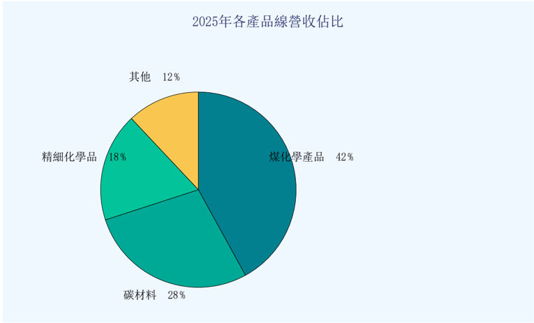
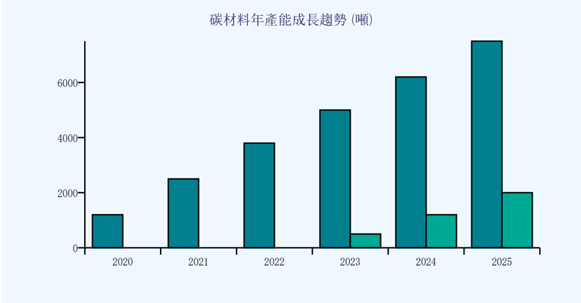
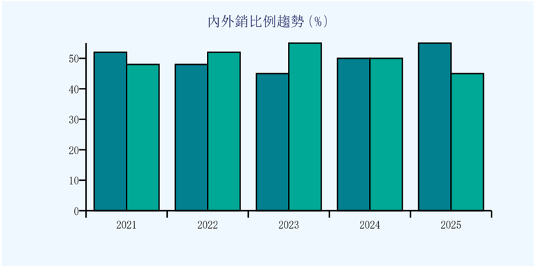

## 中碳產品與技術介紹

## 煤化學產品及先進碳材料

這張圖片是一個單色的 pie chart，其中已分散四個不同級段：最高級為 42%, 第二、第三、第四等級有42%、19%、28%、12% 的比重。

圖1：2025年各產品線營收佔⽐

> **AI 描述:** 這張圖片是一個單色的 pie chart，其中已分散四個不同級段：最高級為 42%, 第二、第三、第四等級有42%、19%、28%、12% 的比重。

## ⼀、煤化學產品系列

煤化學產品為公司營收的核⼼⽀柱。公司以中鋼集團煉焦過程中的副產品--煤焦油和輕油為原料，透 過精密蒸餾技術，分離提純出多種⾼附加價值的化學品。主要產品包含軟瀝青、精製煤焦油、雜酚油、精萘 、苯及甲苯等。

| 產品類別   | 主要產品                          | 年產能    | 主要⽤途                           |
|------------|-----------------------------------|-----------|------------------------------------|
| 軟瀝青     | 90R&B;軟瀝青 70R&B;軟瀝青煤焦瀝青 | 85,000噸  | 鋁業陽極材料碳素電極黏結劑耐⽕材料 |
| 精萘系列   | 精萘⼆萘酚                        | 15,000噸  | 染料中間體農藥原料塑化劑           |
| 芳⾹烴     | 苯甲苯                            | 45,000噸  | 溶劑合成橡膠原料醫藥中間體         |
| 防護材料   | 雜酚油⽊材防腐油 屋頂防漏膠       | 8,000噸   | 枕⽊防腐建築防⽔⽊材保護           |
| 焦碳系列   | 焦碳焦碳粉細焦碳粉                | 120,000噸 | 煉鋼輔料鑄造燃料碳材料原料         |

表1：煤化學產品⼀覽表

## ⼆、先進碳材料（重點發展領域）

先進碳材料是公司近年積極拓展的重點領域，特別是應⽤於電動⾞鋰電池負極材料的介相碳微球（MCM B）及介相⽯墨碳微球產品。隨著全球電動⾞市場蓬勃發展，公司碳材料業務呈現快速成⾧態勢。

在 this graph, it shows the sales revenue of a specific product over five years from 2018 to 2023. Each year is represented by a bar, with values clearly marked. The x-axis indicates the years from 2018 to 2023, whereas the y-axis represents the sales revenue in millions of dollars. The bars are colored in blue, and there is a legend at the top providing the color code for the different years. 

The label "鄇杰科年產能成長趨勢" suggests a focus on product development strategies, likely referring to an investment or growth trend within a certain company or industry. The increasing height of the bars indicates growth in sales revenue from year to year. Moreover, there is a significant jump in the sales revenue for the year 2023 compared to 2022 and 2021. 

This graph seems to provide a clear visual representation of the company's performance over this period, highlighting their success during growth years and pointing out a potential opportunity for further improvements or market expansion, as reflected by the steadily rising sales trends.

圖2：MCMB(藍) 與⽯墨碳微球(綠) 年產能趨勢

> **AI 描述:** 在 this graph, it shows the sales revenue of a specific product over five years from 2018 to 2023. Each year is represented by a bar, with values clearly marked. The x-axis indicates the years from 2018 to 2023, whereas the y-axis represents the sales revenue in millions of dollars. The bars are colored in blue, and there is a legend at the top providing the color code for the different years. 

The label "鄇杰科年產能成長趨勢" suggests a focus on product development strategies, likely referring to an investment or growth trend within a certain company or industry. The increasing height of the bars indicates growth in sales revenue from year to year. Moreover, there is a significant jump in the sales revenue for the year 2023 compared to 2022 and 2021. 

This graph seems to provide a clear visual representation of the company's performance over this period, highlighting their success during growth years and pointing out a potential opportunity for further improvements or market expansion, as reflected by the steadily rising sales trends.

表2：先進碳材料產品規格與市場概況

| 產品              | 規格                                | 年產能               | 主要應⽤                            | 全球市佔        |
|-------------------|-------------------------------------|----------------------|-------------------------------------|-----------------|
| 介相碳微球 (MCMB) | D50:10-25um⽐容量: 310-330mAh/g     | 7,500噸/年 (8條產線) | 消費電⼦鋰電池 電動⼯具電池儲能系統 | 全球第⼀(約35%) |
| 介相⽯墨碳微球    | D50:15-23um⽐容量: 345-360mAh/g     | 2,000噸/年(屏南廠)   | 電動⾞鋰電池 AI伺服器UPS超級電容    | 亞太前三(約15%) |
| 等⽅性⽯墨塊材    | 密度:1.75-1.85g/cm3 抗彎強度:>40MPa | 研發量產中           | 半導體⾧晶坩堝 EDM電極核能材料      | 開發中          |

## 三、市場分布與應⽤領域

公司產品內外銷各佔約50%，外銷市場主要涵蓋⽇本、韓國、中國⼤陸、東南亞及歐美等地。近年來隨 著電動⾞與AI產業快速發展，碳材料外銷⽐例持續攀升，已成為拉動公司營收成⾧的主要動⼒。

The bar chart shows comparative data on GDP growth in five different countries from 2021 to 2025. Each year features five bars representing those countries' respective values across the same period, with an estimated value atop each bar for easy interpretation of growth rates. A key legend clarifies what each color represents, with green denoting positive growth, blue neutral growth, and red negative growth. The chart is marked by dark blue borders framing the plot within a light blue background and includes titled axis labels for enhanced clarity.

圖3：內銷(藍) 與外銷(綠) ⽐例趨勢

> **AI 描述:** The bar chart shows comparative data on GDP growth in five different countries from 2021 to 2025. Each year features five bars representing those countries' respective values across the same period, with an estimated value atop each bar for easy interpretation of growth rates. A key legend clarifies what each color represents, with green denoting positive growth, blue neutral growth, and red negative growth. The chart is marked by dark blue borders framing the plot within a light blue background and includes titled axis labels for enhanced clarity.

